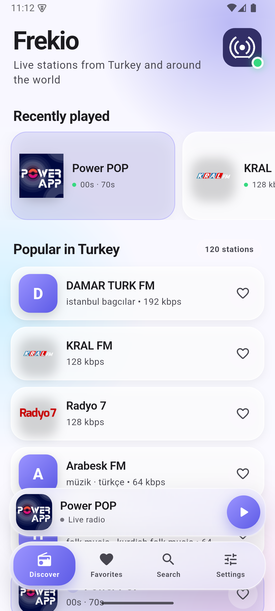
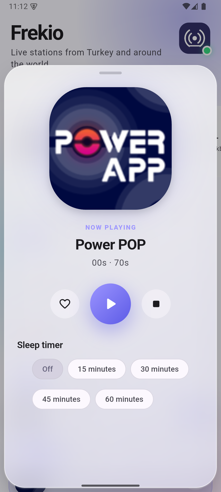
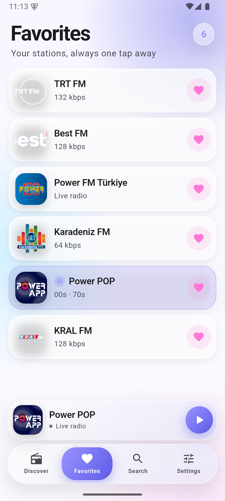
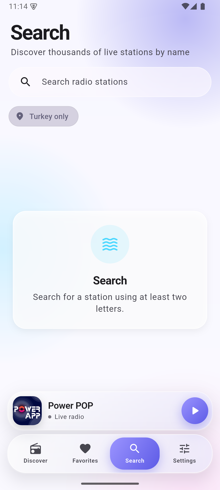
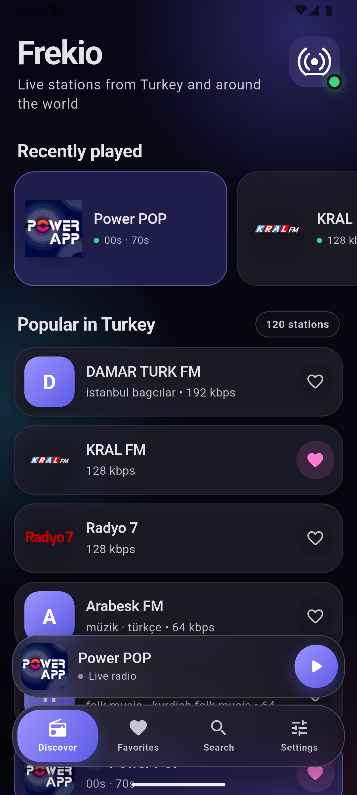

<div align="center">
  
  <h1>Frekio</h1>
  <p><strong>A focused, privacy-respecting Internet radio app for Android and iOS.</strong></p>
  <p>
    Discover live stations from Turkey, search worldwide, and keep listening across
    your phone, home screen, car, and system media controls.
  </p>
  <p>
    
    
    
    
  </p>
</div>

## Overview

Frekio is an open-source Flutter application that keeps Internet radio simple. It
uses the community-operated [Radio Browser](https://www.radio-browser.info/)
directory instead of shipping a hardcoded station catalogue. The app has no
account system, advertising SDK, analytics SDK, or developer-operated backend.

The product is designed around native media behavior: background playback,
lock-screen and notification controls, home-screen widgets, Android Auto, and
CarPlay all share the same playback state.

## Screenshots

<p align="center">
  
  
  
  
  
</p>

## Features

- Turkey-first discovery backed by the live Radio Browser catalogue.
- Worldwide station search with an optional Turkey-only filter.
- Favorites, recently played stations, and last-station restoration.
- Live ICY programme and track metadata when provided by the broadcaster.
- Background playback with bounded reconnect behavior and a sleep timer.
- Android MediaStyle and iOS Now Playing controls.
- First-play Android media-player permission with system-settings recovery;
  iOS Now Playing requires no notification permission.
- Native in-app rating prompts after meaningful use.
- Automatic store update checks and Google Play in-app updates.
- Interactive Android and iOS 17+ home-screen widgets.
- Android Auto browsing, playback, and voice search.
- Native CarPlay Favorites and Recent templates.
- Responsive phone, tablet, and iPad layouts.
- Turkish and English localization.
- Light, dark, and system appearance modes.
- No ads, accounts, analytics, tracking, Firebase, or paid runtime services.

## Platform support

| Capability | Android | iOS |
| --- | --- | --- |
| Background audio | Foreground media service | Background audio mode |
| System controls | MediaSession + MediaStyle | Now Playing + remote commands |
| Home-screen widget | AppWidgetProvider | WidgetKit, iOS 17+ |
| In-car experience | Android Auto | CarPlay audio templates |
| Adaptive layout | Phone and tablet | iPhone and iPad |
| Ratings | Google Play In-App Review | StoreKit review prompt |
| Updates | Google Play in-app update | App Store version check |

CarPlay distribution requires the appropriate capability from Apple. The App
Group used by the iOS app and widget must also be enabled in the Apple Developer
portal. See [Native setup](docs/NATIVE_SETUP.md) before signing a release build.

## Architecture

Frekio deliberately uses a compact, dependency-light architecture:

```text
lib/
├── src/data/       Radio Browser API and local preferences
├── src/domain/     Immutable station model
├── src/services/   Audio, system media, and widget bridges
├── src/ui/         Adaptive pages, components, and design system
├── src/app_state.dart
└── main.dart
```

One audio handler is the source of truth for the app UI, widgets, notification
controls, Android Auto, and CarPlay. Catalogue requests are cached, searches are
user-driven, widget updates are event-driven, and stream retries are bounded to
avoid unnecessary background work.

See [Architecture](docs/ARCHITECTURE.md) for implementation details.

## Getting started

### Prerequisites

- The current stable [Flutter SDK](https://docs.flutter.dev/get-started/install).
- Android Studio and an Android SDK for Android builds.
- macOS with Xcode for iOS builds.
- CocoaPods or its bundled `xcodeproj` Ruby gem when regenerating the iOS widget
  target through the setup script.

### Run the checked-in project

```bash
flutter pub get
flutter analyze
flutter test
flutter run
```

### Recreate native scaffolding

The repository includes a reproducible setup script for refreshing Flutter's
generated Android and iOS scaffolding while restoring Frekio-owned native files:

```bash
chmod +x tool/setup.sh
./tool/setup.sh
```

The script runs dependency resolution, formatting, static analysis, and tests.
For a structural check on a machine without Flutter, run:

```bash
python3 tool/verify_source.py
```

## Building

```bash
# Android debug APK
flutter build apk --debug

# Android release app bundle
flutter build appbundle --release

# iOS release build; signing must be configured in Xcode
flutter build ios --release
```

Release signing files and developer credentials are intentionally excluded from
version control. Follow [the release checklist](docs/RELEASE_CHECKLIST.md) before
publishing.

## Privacy

Frekio stores favorites, recent stations, cached catalogue data, and preferences
locally. It connects to Radio Browser for directory requests and station-click
reporting, and directly to the selected broadcaster to play audio. AlpWare Studio
does not receive listening history through a developer-operated backend.

Read the [web privacy policy](docs/index.html) or the
[repository policy](PRIVACY.md) for the complete disclosure.

## Contributing

Contributions are welcome. Please read [CONTRIBUTING.md](CONTRIBUTING.md), keep
dependencies minimal, preserve both English and Turkish UI coverage, and run:

```bash
dart format .
flutter analyze
flutter test
```

Open an issue before introducing a new backend, analytics, advertising, account
system, sensitive permission, or recurring background task.

## Security

Please do not report security vulnerabilities in a public issue. Follow the
private reporting instructions in [SECURITY.md](SECURITY.md).

## License and content notice

Frekio source code is released under the [MIT License](LICENSE).

Radio streams, station names, logos, artwork, programme metadata, and other
broadcaster content remain the property of their respective owners and are not
covered by the source-code license. Frekio does not host or rebroadcast stations;
availability and geographic restrictions are controlled by each broadcaster.

---

<div align="center">
  Built and maintained by <a href="https://www.alpwarestudio.com/">AlpWare Studio</a>.
</div>
